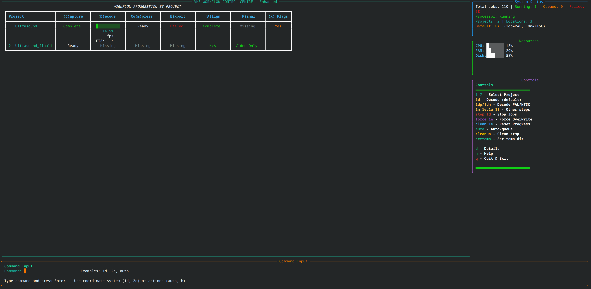

# DDD Capture Toolkit

**Finally, proper audio sync for Domesday Duplicator VHS captures.**

The Domesday Duplicator captures stunning RF video from VHS tapes, but it doesn't capture audio at the same time. This toolkit solves the audio synchronisation problem that has plagued DdD users since day one.



## Why This Exists

The Domesday Duplicator is fantastic hardware for RF capture, but it captures video RF and audio as separate processes that aren't synchronised. This creates a nightmare of problems:

- **Two separate processes** - RF and audio captured by different hardware
- **Different start times** - No way to trigger both captures at exactly the same moment
- **Clock drift** - Independent clocks slowly drift apart over the length of a tape
- **VCR speed variation** - Your VCR doesn't play at exactly 50fps (PAL) or 59.97fps (NTSC)

The result? Audio that starts out of sync, drifts further over time, and requires tedious manual alignment.

## Previous Workarounds (And Why They Don't Work)

Before this toolkit, DdD users had limited options:

### Capture the tape twice
Run the DdD once for video RF, then again while recording audio separately. Problems:
- No two tape passes are identical (different tracking, dropout positions, speed variations)
- You still have to manually align the audio
- No reliable `.tbc.json` timing data to compensate for VCR speed variation across two different captures
- Doubles your capture time and tape wear

### Simultaneous audio to a separate device
Capture audio to a different recorder (e.g., a Mac via a players audio outputs) while the DdD captures RF. Problems:
- Still need to manually figure out the start offset
- No clock synchronisation between devices means drift over time
- Manual extraction and alignment workflow
- Different sample rates and timing references

### Two Domesday Duplicators
Use one DdD for video RF, another configured for audio RF capture. Problems:
- Expensive (two DdDs!)
- The DomesdayDuplicator software is GUI-only - no way to trigger both simultaneously
- Still need to synchronise the clocks between both units
- Still need to align the audio and compensate for drift

**The fundamental problem:** Even if you could capture RF and audio at exactly the same moment, the DomesdayDuplicator software had no command-line interface - you couldn't programmatically start captures, which made proper automation impossible.

## How This Toolkit Solves It

### Command-Line Control for DomesdayDuplicator

As part of this project, **command-line features have been added to the DomesdayDuplicator software**, enabling:

```bash
DomesdayDuplicator --start-capture --headless  # Start capture without GUI
DomesdayDuplicator --stop-capture              # Stop capture programmatically
```

This is the foundation that makes everything else possible - you can now script and automate DdD captures.

### Three-Part Synchronisation Solution

#### 1. Synchronised Capture with Clockgen Lite

The toolkit integrates with [Clockgen Lite](https://github.com/namazso/cxadc-clockgen-mod) (cxadc-clockgen-mod), which clocks the Domesday Duplicator and audio ADC from the same master clock source:

- **Sample-level synchronisation** - Every RF sample has a corresponding audio sample
- **No clock drift** - Both capture streams stay perfectly aligned
- **Consistent timing** - Wow and flutter captured identically in both streams

The capture script (`ddd_clockgen_sync.py`) uses the new command-line interface to start both captures with precise timing.

#### 2. Initial Audio Offset Calculation

Even with synchronised clocks, the two capture processes start at slightly different times. The toolkit calculates this initial offset through:

- Automated 1kHz test tone analysis for calibration captures
- Precision timing measurement between audio and video start points
- Automatic application of the calculated offset during final muxing

#### 3. VhsDecodeAutoAudioAlign (Speed Compensation)

Your VCR doesn't play at exactly 50fps. It might be 50.0001fps, which means over a 2-hour tape, the audio drifts noticeably. The integrated [VhsDecodeAutoAudioAlign](https://gitlab.com/wolfre/vhs-decode-auto-audio-align) by **Rene Wolf** solves this by:

1. Reading actual field timing from the `.tbc.json` file produced by vhs-decode
2. Calculating where each video field actually occurs in time
3. Time-stretching/compressing the audio to match the real video field boundaries
4. Handling dropped fields (tape damage) by skipping the corresponding audio

The result: audio that stays perfectly synchronised throughout the entire tape, regardless of VCR speed variations or tape damage.

## Features

- **Automated A/V sync** - The main event: proper audio synchronisation for DdD captures
- **Complete workflow** - From RF capture through to final muxed output
- **Cross-platform** - Works on Linux, macOS, and Windows
- **Interactive UI** - Rich terminal-based control centre for monitoring jobs
- **Job queue** - Parallel processing and batch operations
- **Command-line DdD control** - Scriptable capture automation

## Quick Start

### Prerequisites

- **Conda** (Miniconda or Anaconda)
- **Git** (for cloning and submodules)
- **Domesday Duplicator hardware** (for capture)
- **Clockgen Lite mod** (recommended for synchronised audio capture)

### Installation

1. **Clone the repository with submodules:**
   ```bash
   git clone --recurse-submodules <repository-url>
   cd ddd-capture-toolkit
   ```

   Or if already cloned:
   ```bash
   git submodule update --init --recursive
   ```

2. **Run setup:**
   ```bash
   ./setup.sh
   ```

3. **Activate and launch:**
   ```bash
   conda activate ddd-capture-toolkit
   python3 ddd_main_menu.py
   ```

### Installation Modes

**Easy Mode (default):**
```bash
./setup.sh
```
- Pre-compiled packages, ~5 minute setup
- Good performance for most users

**Performance Mode:**
```bash
./setup.sh --performance
```
- Source compilation with CPU optimizations
- 30-60 minute setup, 10-30% faster processing
- Recommended for production use

**Specify vhs-decode version:**
```bash
./setup.sh --performance --vhs-decode-version 0.3.8.1
./setup.sh --performance --vhs-decode-version latest  # bleeding edge
```

**Uninstall:**
```bash
./setup.sh --uninstall
```

## Usage

### First Time Setup

1. **Configure processing locations** (Menu -> Configuration -> Manage Processing Locations)
2. **Check dependencies** (Menu -> System -> Check Dependencies)

### Workflow

1. **Capture** - Menu option 1 for VHS capture workflows
2. **Monitor** - Menu option 2.1 for the Workflow Control Centre
3. **Process** - Jobs progress automatically:
   - Decode (vhs-decode processing)
   - Compress (TBC compression)
   - Export (TBC to video)
   - Align (audio synchronisation)
   - Final (mux audio and video)

### Workflow Control Centre

Interactive monitoring with project matrix view, real-time progress, and job management.

**Commands:**
- `h` - Help
- `d` - Detailed information
- `q` - Quit
- `clean <project><step>` - Clean stuck jobs (e.g., `clean 1e`)
- `force <project><step>` - Force restart step

## Technical Details

### The Audio Alignment Pipeline

```
RF Capture (40MSps)     ████████████████████████████████████████
Audio Capture (48kHz)     ████████████████████████████████████████
                        ↑                                        ↑
                   Start offset                            VCR speed variation
```

Without correction, audio starts out of sync and drifts. The solution:

1. **Clockgen Lite** syncs capture clocks (eliminates drift)
2. **Offset calculation** measures start time difference
3. **VhsDecodeAutoAudioAlign** compensates for VCR speed variation using `.tbc.json` field timing

The `.tbc.json` contains actual field timing from the RF capture. With Clockgen Lite keeping audio and RF in sample-level sync, these timings can stretch/compress audio to match exactly.

### How Speed Compensation Works

The alignment tool maps output samples to input samples via linear projection:

```
Output sample 10000 → input sample 9998.7 (via timing projection)
```

Nearest-neighbour interpolation is used. This works because speed differences are tiny - sample skipping/duplication is rare and inaudible.

For dropped fields (tape damage), corresponding audio is skipped to maintain sync.

## Platform Notes

**Linux** - Full support, recommended for production

**macOS** - Requires Xcode CLI tools, uses conda-forge

**Windows** - WSL recommended, some tools need manual setup

## Troubleshooting

**"name 'Layout' is not defined":**
```bash
conda activate ddd-capture-toolkit
python3 -c "from rich.layout import Layout; print('OK')"
```

**Missing dependencies:**
```bash
./clean-setup.sh && ./setup.sh
```

**VhsDecodeAutoAudioAlign.exe not found:**
- Download from [vhs-decode releases](https://github.com/oyvindln/vhs-decode/releases) or [GitLab](https://gitlab.com/wolfre/vhs-decode-auto-audio-align)
- Place in `tools/audio-sync/VhsDecodeAutoAudioAlign.exe`

## Architecture

- **Main Menu** (`ddd_main_menu.py`) - Entry point
- **Workflow Control Centre** (`workflow_control_centre.py`) - Interactive monitoring
- **Job Queue Manager** (`job_queue_manager.py`) - Parallel processing
- **Project Discovery** (`project_discovery.py`) - Auto-detection
- **Clockgen Sync Capture** (`ddd_clockgen_sync.py`) - Synchronised A/V capture
- **Audio Alignment** (`tools/audio-sync/`) - VhsDecodeAutoAudioAlign integration

## Credits

- [vhs-decode](https://github.com/oyvindln/vhs-decode) - VHS RF decoding
- [ld-decode](https://github.com/happycube/ld-decode) - LaserDisc/VHS decoding foundation
- [tbc-video-export](https://github.com/JuniorIsAJitterbug/tbc-video-export) - TBC to video conversion
- [Domesday Duplicator](https://github.com/simoninns/DomesdayDuplicator) - RF capture hardware
- [VhsDecodeAutoAudioAlign](https://gitlab.com/wolfre/vhs-decode-auto-audio-align) - Audio drift compensation by **Rene Wolf**
- [Clockgen Lite](https://github.com/namazso/cxadc-clockgen-mod) - Clock synchronisation mod

## Licence

This project integrates multiple open-source components. See individual component licences for terms.
